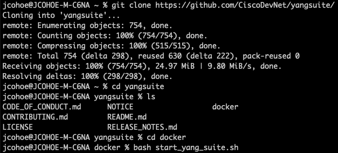
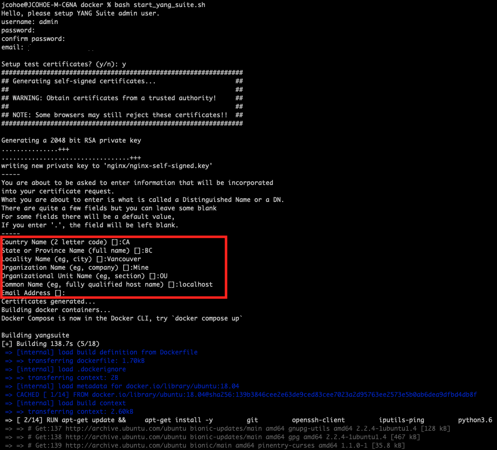

Copyright 2022 Cisco Systems, Inc

Cisco YANG Suite
==========

YANG Suite core Django application.

Capable of dynamic discovery of installed application plugins.
Provides common library APIs for logging, filesystem access,
GUI appearance and behavior, and client-server communication.

- Authors:  Members of the Cisco YANG Suite development team.
- Supports: Python 3.6, Python 3.7, and Python 3.8

YANG Suite can be installed as a Docker container or through Python
package management.  Docker-compose is the recommended install.

YANG Suite requires about 3.5GB of memory to load large Cisco native models.

## YANG Suite Resources

DevNet YANG Suite landing page: [developer.cisco.com/yangsuite](https://developer.cisco.com/yangsuite)

Documentation: [developer.cisco.com/docs/yangsuite](https://developer.cisco.com/docs/yangsuite)

[YANG Suite TDM PDF](https://pubhub.devnetcloud.com/media/yang-suite/docs/YANGSuite%20TDM%20-%20Communities.pdf)
----------------------------
This PDF document has technical details of all capabilites of the YANG Suite tool, including installation, setup, and use of all plugins and features. It is a very detailed document that can be refered to for using the tool and examples for each plugin.


# YANG Suite Installation: Docker or PIP? You decide

| Feature       | Docker                | PIP          |
| ------------- | -------------         | -------------|
| Security      | HTTPS                 | HTTP         |
<!--- | Ports Used    | 80 forwarded to 8443  | -->


## Prerequisites for Docker

To use the resources in this repository, you must install Docker on the system where you want to run YANG Suite. In addition, since this YANG Suite repository uses Docker Compose, your system needs Docker Compose. Docker Desktop for Mac and Docker Desktop for Windows installations include Compose and you can install those using instructions at https://docs.docker.com/install. For Linux, follow [these specific instructions to install Docker Compose on Linux systems](https://docs.docker.com/compose/install/#install-compose-on-linux-systems).

## Quick Start with Docker:

1. Clone this repository

2. Run start_yang_suite.sh or, 

3. Run docker compose up if you have already ran the start_yang_suite.sh

4. Access the tool at http://localhost or https://localhost:8443

```
git clone https://github.com/CiscoDevNet/yangsuite
cd yangsuite/docker/ ; bash ./start_yang_suite.sh
    or
cd yangsuite/docker/ ; docker compose up
    or
cd yangsuite/docker/ ; docker-compose up
```

The output should look similar to the image below:



The start_yang_suite.sh will ask to set the username, password, e-mail address, and for the certificate details. The output will look similar to the below, be sure to enter certificate details in the red hilight area:



Once YANG Suite is ready for use the following will be seen:


Now you can access the YANG Suite at http://localhost


Docker-based YANG Suite Installation
------------------------------------

The yangsuite/docker/start_yang_suite.sh script performs the following:

- Prompts for username, password, and email which will be the superuser to yangsuite.
- Gives the choice of creating test SSL/TLS certificate and key.
- Creates an environment file needed for the yangsuite docker container install.
- Runs docker-compose up.

Self-signed Certificate for testing
-----------------------------------

The SSL/TLS certificates installed with the nginx container should be obtained or generated using a trusted
certificate authority.  As a convenience, the yangsuite/docker/start_yang_suite.sh script will
generate a self-signed certificate/key to get you going quickly.

**WARNING:** Official SSL/TLS certificate/key should be obtained and copied to yangsuite/docker/nginx directory rather than using the test SSL/TLS certificate/key generated by the start_yang_suite.sh script.

Customization
-------------

The yangsuite/docker/yangsuite/production.py file contains Django settings.  The possible settings are extensive and information can found at https://www.djangoproject.com/.

Adding/Updating plugins can be done through the Admin-->Manage plugins page or by copying
the plugin wheels into the yangsuite/docker/yangsuite/ directory, uncomment the appropriate
lines in the yangsuite/docker/yangsuite/dockerfile, and run:

    docker-compose up --build

Access YANG Suite Docker Install with web browser
-------------------------------------------------

- The nginx container redirects port 80 to port 8443 which is used to interface with the yangsuite core.  Connect to http://localhost or https://localhost:8443. **NOTE:** A complaint about the certificate will appear if it was generated using "start_yang_suite.sh".
- The yangsuite-restconf plugin uses port 443 to communicate to your Cisco device so enable RESTCONF in the YANG Suite Device profile page for devices that support that protocol.
- If port 8443 is not available for use on the server, change the port number in the docker-compose.yml file and the nginx.conf file.
- If port 443 is not available for use on the server, change the port number in the docker-compose.yml file, configure the new RESTCONF port on the Cisco device, and configure the correct RESTCONF port in the YANG Suite Device profile.
- Login using username set during install.

Quick Start with PIP Install on MacOS
------------------------------

We recommend installing Homebrew to manage the Python installation on your mac.

Refer to the [HomeBrew website](https://brew.sh) for details on how to install HomeBrew on your Mac, or, follow the command below to install HomeBrew:

```
/bin/bash -c "$(curl -fsSL https://raw.githubusercontent.com/Homebrew/install/HEAD/install.sh)"
```

Use brew to install pyenv

```
brew install pyenv
```

Once pyenv is installed, install Python version 3.8

```
pyenv install 3.8
```

Now that the correct and YANG Suite-supported version of Python 3.8 is installed, create and activate the virtual environment

```
cd ~/.pyenv/versions/3.8.12/bin/python -m venv yangsuitevenv
source yangsuiteenv/bin/activate
```

Next, install the YANG Suite tool within the virutal evnrionment using pip:

```
pip install pip wheel setuptools --upgrade
pip install yangsuite
```

Now that YANG Suite is installed, it can be started up. The credentials and settings will be configured on the first run:

```
yangsuite
```

Once started the tool can be access on the default port http://localhost:8480

See a full example of installing pre-requisites and configuring YANG Suite below:


PIP install using Linux
----------------------------
**NOTE** For Linux to run YANG Suite, a virtual environment is required


Re-configuring yangsuite Server
----------------------------

- Activate the virtual environment
- Type yangsuite -h

Create an automated test environment using PyATS
----------------------------
See the PyATS Docs: https://developer.cisco.com/docs/pyats-getting-started/


Pre Release Versions
----------------------------
Manually specify pre-release version when using pip like in the example below to access the pre release and bug fix versions of yang suite and plugins:

```
docker container exec -it <yangsuite container ID> bash
pip install --upgrade --pre yangsuite-devices
exit

pip
source <your yangsuite venv>/bin/activate
pip install --upgrade --pre yangsuite-devices
```


